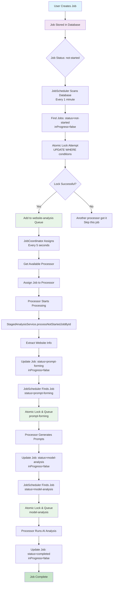
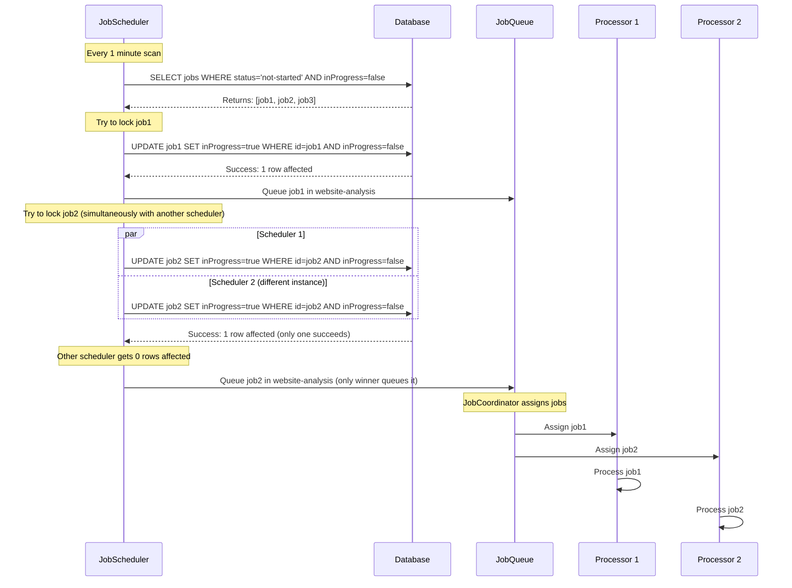
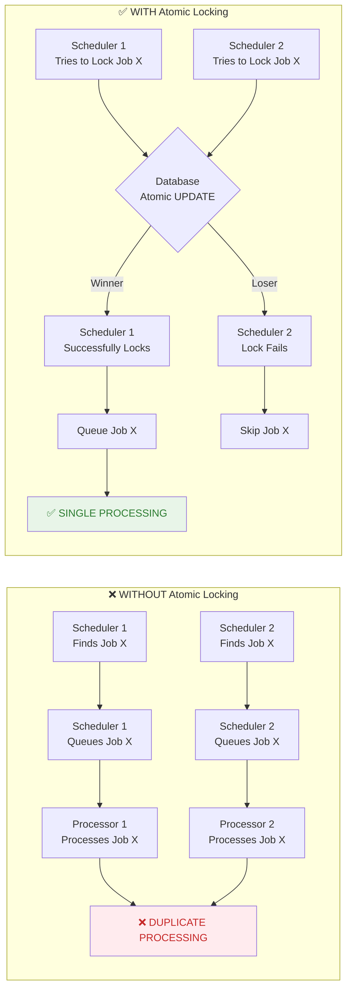
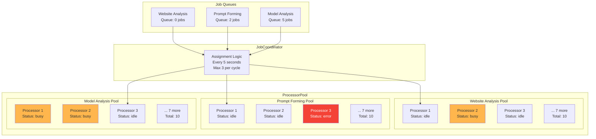
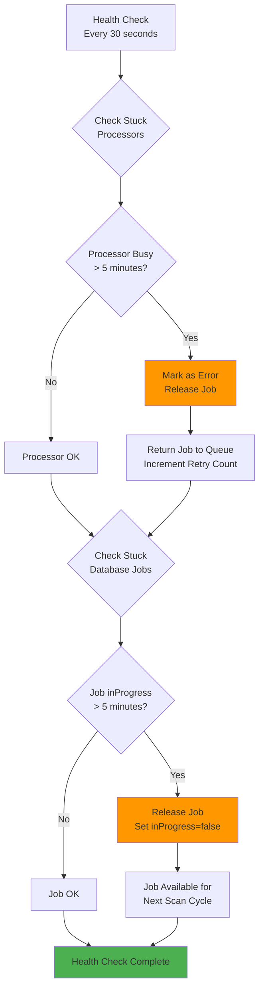
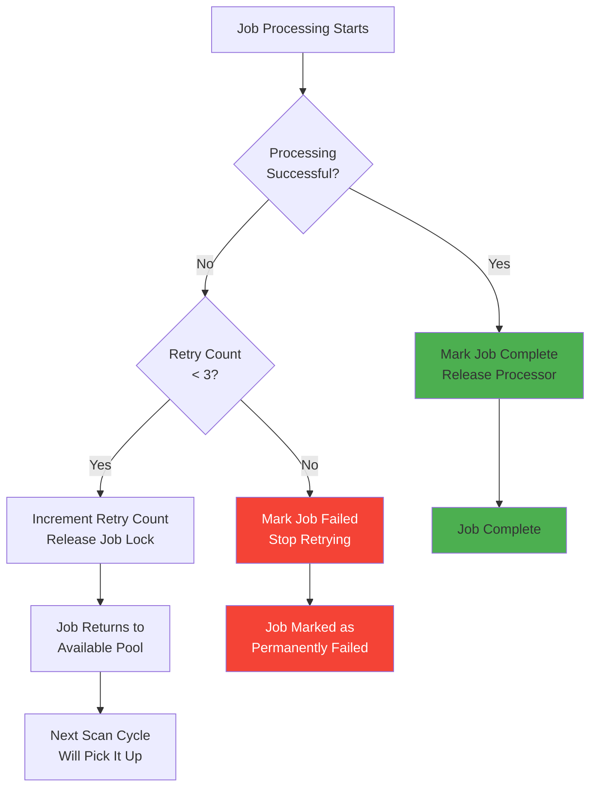
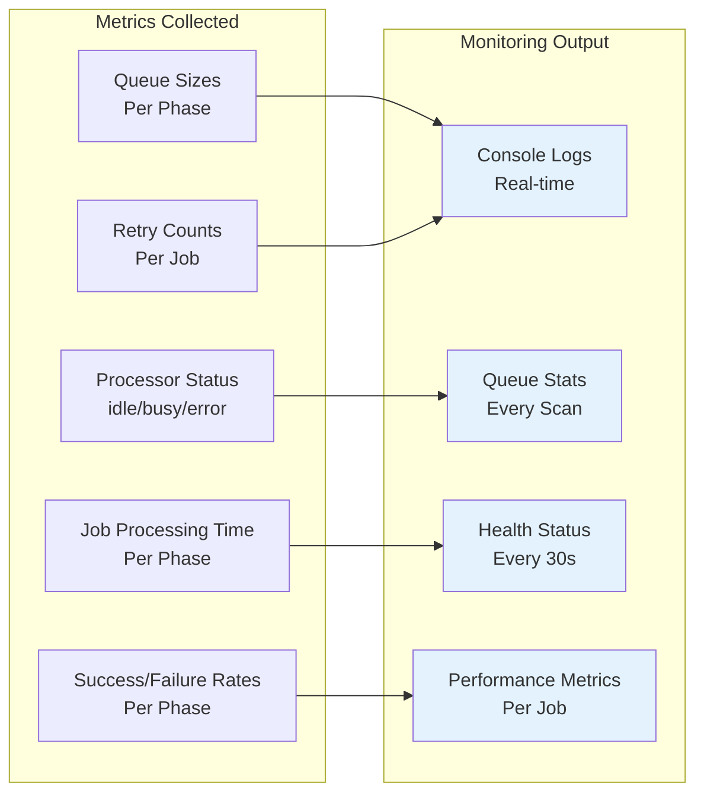

# Background Processing Flow Diagrams

## Complete Job Processing Flow



## Atomic Locking Mechanism



## Race Condition Prevention



## Queue Safety Mechanisms

```mermaid
graph TD
    A[Job Arrives at Queue] --> B{Already in<br/>Same Phase Queue?}
    B -->|Yes| C[❌ Reject: Already Queued]
    B -->|No| D{Already Being<br/>Processed?}
    
    D -->|Yes| E[❌ Reject: Currently Processing]
    D -->|No| F{In Other<br/>Phase Queue?}
    
    F -->|Yes| G[❌ Reject: Wrong Phase]
    F -->|No| H{Queue Full?<br/>(Max 1000)}
    
    H -->|Yes| I[❌ Reject: Queue Full]
    H -->|No| J[✅ Accept: Add to Queue]
    
    style C fill:#ffebee
    style E fill:#ffebee
    style G fill:#ffebee
    style I fill:#ffebee
    style J fill:#e8f5e8
```

## Processor Pool Architecture



## Health Check and Recovery



## System Timing and Coordination

```mermaid
gantt
    title Background Processing Timeline
    dateFormat X
    axisFormat %Ss

    section JobScheduler
    Scan Database       :0, 60
    Scan Database       :60, 120
    Scan Database       :120, 180

    section JobCoordinator  
    Assign Jobs         :0, 5
    Assign Jobs         :5, 10
    Assign Jobs         :10, 15
    Assign Jobs         :15, 20
    Assign Jobs         :20, 25

    section Health Checks
    Health Check        :0, 30
    Health Check        :30, 60
    Health Check        :60, 90

    section Stuck Job Cleanup
    Cleanup Cycle       :0, 300
    Cleanup Cycle       :300, 600
```



## Error Handling and Retry Logic



## Performance Monitoring



## Key Success Factors

### 1. **Atomic Database Operations**
- All job locking uses `UPDATE ... WHERE` with multiple conditions
- Only successful updates result in job queueing
- Database handles concurrency at the lowest level

### 2. **Multiple Safety Layers**
- Database-level locking (primary)
- Queue-level duplicate detection (secondary)
- Cross-queue validation (tertiary)

### 3. **Controlled Resource Usage**
- Limited batch sizes (10 jobs per scan)
- Throttled assignments (3 per cycle)
- Reasonable timing intervals

### 4. **Comprehensive Recovery**
- Stuck job detection and release
- Processor health monitoring
- Automatic retry with limits

### 5. **Observable System**
- Detailed logging at every step
- Real-time status monitoring
- Performance metrics collection

This architecture ensures that each website is processed by exactly one processor at any given time, preventing the duplicate processing issues you observed.